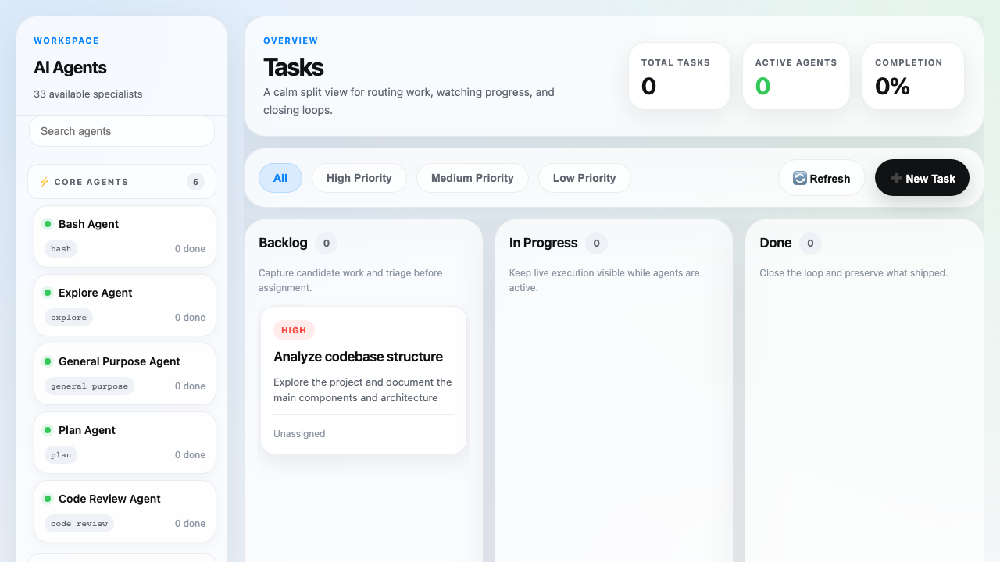
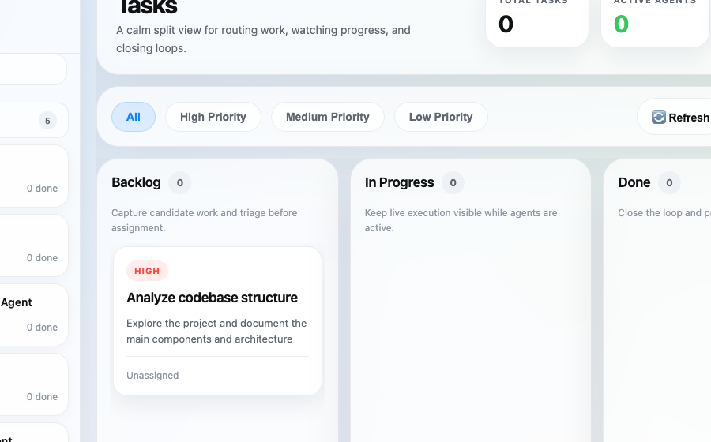

# <div align="center">Agent Task Dashboard</div>

<div align="center">
  A local command center for planning, assigning, and tracking AI agent work without adding backend weight.
</div>

<div align="center">
  <br />
  
</div>

## Why This Exists

Most agent workflows break down in the same place: work is happening, but nobody has a crisp operating surface for what is queued, who is doing it, and what is blocked.

Agent Task Dashboard gives you a lightweight local UI for:

- seeing agent capacity in one place
- routing work into backlog, in progress, and done states
- filtering by priority or assigned agent
- managing an agent workflow without standing up a database or a full SaaS stack

The current UI direction is intentionally minimalist: light surfaces, rounded split-view panels, calmer hierarchy, and a more native desktop feel.

## What You Get

| Outcome | What the product does |
| --- | --- |
| Faster triage | Surfaces active work, backlog, and completion status at a glance |
| Cleaner delegation | Lets you assign tasks to specific agent profiles and track ownership |
| Low-friction setup | Runs as a single Python server with JSON storage and no external services |
| Local control | Keeps the full workflow on your machine for fast iteration and experimentation |

## Product Snapshot

The dashboard is designed around one question: what should the agent system do next?

1. Open the dashboard locally.
2. Review agent availability and queue health.
3. Create or assign work.
4. Move tasks across the loop as execution progresses.

<p align="center">
  
</p>

## Core Experience

### 1. Operate the queue

The main board organizes work into `Backlog`, `In Progress`, and `Done`, with drag-and-drop movement between states.

### 2. Route work to the right agent

The sidebar gives you a quick read on agent type, availability, and task history so delegation is visible instead of implicit.

### 3. Keep execution simple

The app is intentionally light:

- frontend: one HTML file with vanilla JavaScript and CSS
- backend: one Python server exposing REST endpoints
- storage: local JSON files for tasks and agents

### 4. Stay visually calm

The refreshed interface is designed to feel closer to an Apple-native workspace than a conventional admin console:

- split-view layout with a dedicated agent rail
- glassy, low-noise panels
- compact stat cards and pill filters
- reduced chrome around the core task loop

## Best Fit

This repo is a strong fit if you want to:

- prototype an agent operations console locally
- manage work for multiple specialized AI agents
- demo an agent orchestration pattern without cloud infrastructure
- use a readable starter surface before integrating real dispatch logic

## Architecture

```text
Browser UI
  -> agent_dashboard.html
  -> task creation, filtering, drag/drop, stats

Local API
  -> agent_task_server.py
  -> tasks, agents, stats, dispatch actions

Local State
  -> tasks.json
  -> agents.json
```

## Quick Start

```bash
./start_dashboard.sh
```

Then open `http://localhost:8809`.

You can also start it directly:

```bash
python3 agent_task_server.py
```

## API Surface

| Area | Endpoints |
| --- | --- |
| Tasks | `GET /api/tasks`, `POST /api/tasks`, `GET /api/tasks/:id`, `PUT /api/tasks/:id`, `DELETE /api/tasks/:id` |
| Agents | `GET /api/agents`, `POST /api/agents/:id/dispatch` |
| Stats | `GET /api/stats` |

## Current State

As of September 2, 2026, the repo ships with:

- sample tasks preloaded for immediate testing
- multiple specialized agent profiles
- live stats in the top bar
- agent and priority filtering
- drag-and-drop workflow management
- auto-refresh for local dashboard state
- refreshed Apple-inspired split-view UI

## Deeper Product Docs

For the extended product rationale, wireframes, roadmap, and measurement framing, see [`docs/product/README.md`](docs/product/README.md).

## Roadmap Direction

The next layer is not more UI chrome. It is deeper execution wiring:

- real agent dispatch integrations
- GitHub issue sync
- comments and history
- notifications and search
- stronger observability for task lifecycle and throughput
