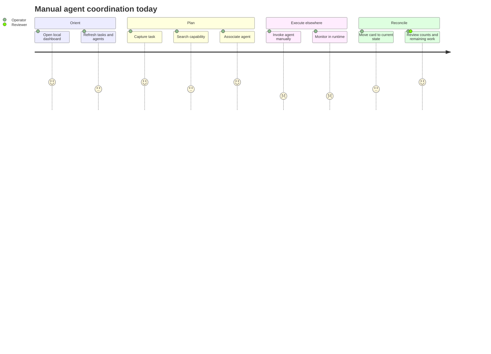

# Users and jobs to be done

## Why user roles matter

The dashboard can serve as a memory aid, a triage surface, or an orchestration console. Only the first two are supported today; personas prevent roadmap language from implying the third.

## Personas

| Persona | Type | Goal | Product boundary |
|---|---|---|---|
| Agent operator / builder | Primary | Capture, assign, and visually track work across specialists | Manually invokes agents outside the dashboard |
| Reviewer or collaborator | Secondary | Understand task state and which specialist is expected to act | Board state may be self-reported |
| Agent-definition maintainer | Secondary | Keep capabilities discoverable and select the right specialist | Catalog configuration is file-backed |
| Autonomous operations controller | Negative | Reliably execute, retry, and cancel production work | Current dispatch does not run agents |
| Workforce-performance evaluator | Negative | Rank people or agents from completion counts | Counts lack quality, complexity, and outcome context |

**Inference:** roles are derived from `AGENT_GUIDE.md` and UI behavior; no interview or analytics evidence exists.

## Contexts and triggers

- A multi-step effort needs specialist handoffs.
- Several independent tasks are active and mental tracking is failing.
- An operator needs to find an agent by capability.
- Priorities shift and work must move between board states.
- The operator returns after a break and needs a quick status reconstruction.
- A task is assigned manually and the board needs to reflect—not cause—that action.

## Jobs

**Functional**

- Capture a task with enough intent for later action.
- Find an agent whose documented capability matches the task.
- See backlog, active, and completed work at a glance.
- Filter noise by agent or priority.
- Reconcile board state after manually invoking an agent.

**Emotional**

- Reduce anxiety that a task or handoff has been forgotten.
- Feel oriented when several specialists are involved.
- Trust that the dashboard is not overstating execution.

**Social**

- Explain the workflow to a collaborator without reconstructing prompt history.
- Demonstrate deliberate specialist selection and review.

## JTBD statements

1. **When** I decompose a complex effort into specialist tasks, **I want to** capture each task and intended agent in one board, **so I can** preserve ownership and sequence outside my working memory.
2. **When** I am unsure which specialist fits a task, **I want to** search capabilities and categories, **so I can** choose based on documented purpose rather than name alone.
3. **When** I manually start or finish agent work, **I want to** update status quickly, **so I can** return later and reconstruct progress.
4. **When** the board cannot save or refresh, **I want to** see a durable error and retained local state, **so I do not** mistake an outdated board for success.
5. **When** I review a project with someone else, **I want to** show tasks and handoffs without exposing full prompts or sensitive output, **so I can** communicate progress at the right abstraction.

## User stories

- As an operator, I can create an unassigned task so discovery does not block capture.
- As an operator, I can change status without a pointer device.
- As an operator, I can tell whether a state was manually set or runtime-observed.
- As a reviewer, I can see when board data was last refreshed.
- As an agent maintainer, I can find zero search results and understand how to broaden the query.
- As a privacy-conscious user, I can link to external artifacts instead of copying sensitive output into a task.

## Forces of progress

| Push | Pull | Anxiety | Habit |
|---|---|---|---|
| Prompt/task state scattered across terminals | One visual board | Board can become stale or duplicative | Notes and terminal history are immediate |
| Specialist catalog is hard to remember | Capability search and categories | Catalog may not match installed runtime | Reusing familiar general-purpose agents |
| Handoffs are forgotten | Explicit owner and state | “Assigned” may imply “running” | Verbal/self-reported status |

## Journey

The low points mark the verified integration gap, not measured satisfaction.
