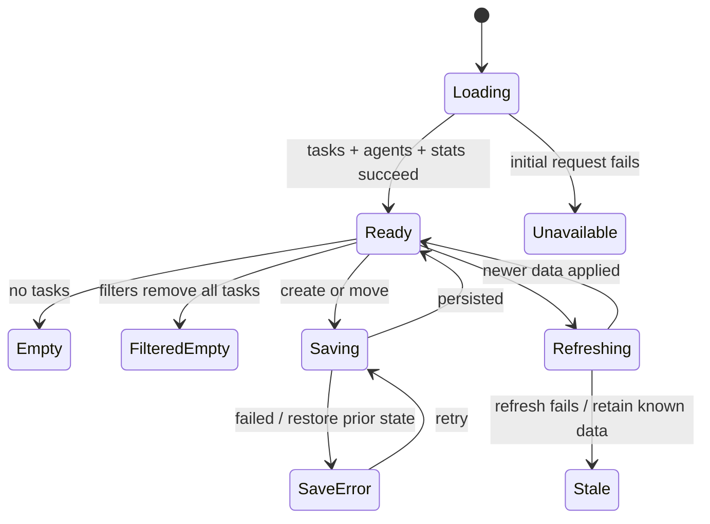

# Product wireframes

## Why these wireframes

The implemented board is usable for local manual tracking, but loading, empty, error, accessibility, and execution-truth states need explicit treatment. The following are proposed evolutions; implementation evidence remains in `agent_dashboard.html`.

## 1. Happy path: board with semantic status

```text
+ Agent Task Dashboard --------------------------------------------+
| Updated 14:06:32  [Refresh]                         [+ New task] |
| Tasks 12 | Active (manual) 3 | Done 5                           |
| Priority: [All] [High] [Medium] [Low]   Agent: [All v]          |
|------------------------------------------------------------------|
| PLANNED (4)        | ACTIVE - MANUAL (3) | DONE (5)              |
| [H] Define API     | [M] Add empty states | [H] Review auth      |
| Agent: Architect   | Agent: General       | Agent: Reviewer      |
| No run linked      | Run: [open ↗]        | Evidence: [diff ↗]   |
| [Start menu...]    | [Move...]            | [Reopen...]          |
+------------------------------------------------------------------+
Annotation: “manual” is visible until an integration supplies runtime proof.
```

Task menus provide keyboard/touch alternatives to drag-and-drop.

## 2. Creation and agent discovery

```text
+ New task --------------------------------------------------------+
| Title *        [____________________________________________]     |
| Description    [____________________________________________]     |
| Priority       [Medium v]                                        |
| Intended agent [Search capabilities...____________________]      |
|                 Core > Explore — pattern and codebase search      |
|                 Feedback > Design Lead — UI/accessibility review  |
| External link  [optional run, issue, or artifact URL________]     |
| [Cancel]                                      [Create in Planned] |
+------------------------------------------------------------------+
```

**Edge:** zero agent matches shows “No capability match; create unassigned” rather than an empty menu.

## 3. Loading and refreshing

```text
+ Loading dashboard ----------------------------------------------+
| Tasks [skeleton]  Active [skeleton]  Done [skeleton]              |
| [agent catalog skeleton] | Restoring local board...               |
+------------------------------------------------------------------+

+ Refreshing ------------------------------------------------------+
| Showing data from 14:06:32                    [spinner] Refreshing |
| Existing cards remain readable; moves are temporarily queued.    |
+------------------------------------------------------------------+
```

Do not clear known-good content during refresh.

## 4. Empty states

```text
+ No tasks yet ----------------------------------------------------+
| Capture the first unit of work. Assignment is optional.           |
| [+ Create first task]                 [Read agent workflow guide]  |
+------------------------------------------------------------------+

+ No tasks match --------------------------------------------------+
| No High-priority tasks for Design Lead.                           |
| [Clear priority] [Clear agent]                                    |
+------------------------------------------------------------------+

+ No agents match -------------------------------------------------+
| No agents match "database migration".                             |
| [Clear search]  Tip: search a capability such as "plan".          |
+------------------------------------------------------------------+
```

## 5. Error and recovery

```text
+ Save failed -----------------------------------------------------+
| ! “Add empty states” was not moved.                               |
| Server returned an update error at 14:07:10.                      |
| Card restored to Planned. [Retry] [Copy task details]             |
+------------------------------------------------------------------+

+ Dashboard unavailable ------------------------------------------+
| Last successful refresh: 14:06:32. Data below may be stale.       |
| [Retry now] [Show local server command]                            |
+------------------------------------------------------------------+
```

Never optimistically leave a card in the new column after a failed update.

## 6. Edge: conflicting update

```text
+ Task changed elsewhere -----------------------------------------+
| Your version: Active      Stored version: Done                    |
| Updated stored: 14:08:11                                       |
| [Keep stored] [Review details] [Apply my change]                  |
+------------------------------------------------------------------+
```

Conflict detection is not shipped; it would require versioning beyond current JSON updates.

## Proposed state flow



## Accessibility and responsive notes

- Use landmarks, headings, native buttons, and labeled inputs; add dialog semantics and focus trapping to task creation.
- Provide Move to Planned/Active/Done controls and keyboard shortcuts; drag-and-drop remains optional.
- Announce save, refresh, and errors with live regions.
- Do not use priority color or agent status dots without text.
- At narrow widths, show one status column at a time with tabs and counts; preserve filters in a collapsible bar.
- Move the agent catalog to a drawer below tablet width; keep selected-agent context visible.
- Respect reduced motion and avoid auto-refresh moving keyboard focus.
